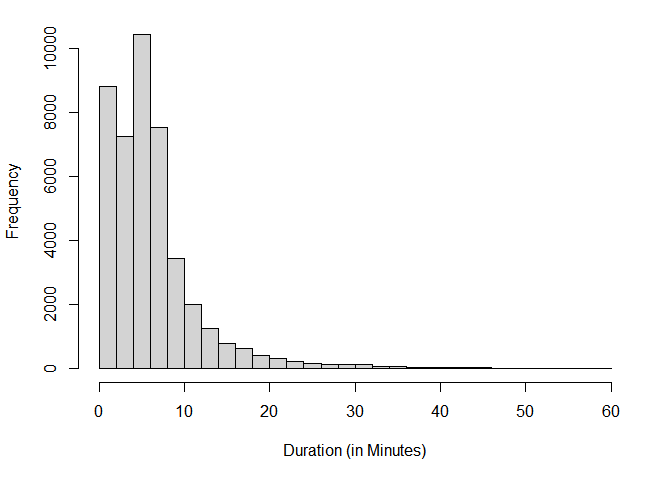

Replication of Figures (Thesis)
================

Packages to Load

``` r
library(dplyr) # For Data Manipulation
library(lme4)  # For Linear Mixed-effects Modeling
library(lmerTest) # For Type III Anova
library(ggplot2) # For Creating Customized Figures
library(gridExtra) # For Two ggplots Next to Each Other
library(corrplot) # Correlation plot
```

Encoding and Data

``` r
encoding <- "UTF-8" 
csv_file <- "sen_youtube_data.csv" 
df <- read.csv(csv_file, fileEncoding = encoding) # Load in the necessary file. Make sure its in the working directory.
```

Figure 5.1 Histogram of View Count

``` r
figure_5_1 <- ggplot(df, aes(x = log_viewCount)) +
  geom_histogram(binwidth = 1, fill = "gray70", color = "black", alpha = 0.7, boundary = -1) +
  labs(x = "View Count (Log)", y = "Frequency") +
  theme_minimal() + theme(plot.title = element_text(hjust = 0.5)) + 
  theme(
    text = element_text(size = 12),
    axis.title.x = element_text(size = 12, margin = margin(t = 10)),
    axis.title.y = element_text(size = 12, margin = margin(r = 10)),
    axis.text = element_text(size = 12, face = "bold"),
    panel.grid.major = element_blank(),
    panel.grid.minor = element_blank()
  ) 
figure_5_1
```

<!-- -->

Function that customized each of the plots - instead of doing it twice

``` r
plot_sentiment_histogram <- function(data, sentiment_column, binwidth = 1/10, title = "", x_label = "Sentiment Score") {
  ggplot(data, aes(x = !!sym(sentiment_column))) +
    geom_histogram(binwidth = binwidth, fill = "gray90", color = "black", alpha = 0.7, boundary = 0) +
    labs(title = title, x = x_label, y = "Frequency") +
    theme_minimal() + 
    theme(plot.title = element_text(hjust = 0.5, size = 16, face = "bold"),
          axis.title.x = element_text(size = 16, margin = margin(t = 10)),
          axis.title.y = element_text(size = 16, margin = margin(r = 10)),
          axis.text = element_text(size = 16, margin = margin(t = 10), face = "bold"),
          axis.text.y.left = element_text(size = 16, margin = margin(r = 10)),
          panel.grid.major = element_blank(),
          panel.grid.minor = element_blank()
    ) 
}
```

Figure 5.2 Histogram of Individual Sentiments

``` r
pos_sent <- plot_sentiment_histogram(df, "pos_prob", title= "Positive")
neg_sent <- plot_sentiment_histogram(df, "neg_prob", title= "Negative")
grid.arrange(pos_sent, neg_sent, ncol = 2) # gridExtra package
```

<!-- -->

Figure 5.3 Histogram of Composite Score

``` r
figure_5_3 <- ggplot(df, aes(x = compound_score)) +
  geom_histogram(binwidth = 0.2, fill = "gray70", color = "black", alpha = 0.7, boundary = -1) +
  labs(x = "Sentiment Score", y = "Frequency") +
  theme_minimal() + theme(plot.title = element_text(hjust = 0.5)) + 
  theme(
    text = element_text(size = 12), 
    axis.title.x = element_text(size = 12, margin = margin(t = 10)),
    axis.title.y = element_text(size = 12, margin = margin(r = 10)),
    axis.text = element_text(size = 12, face = "bold"),
    panel.grid.major = element_blank(),
    panel.grid.minor = element_blank()
  ) 

figure_5_3
```

<!-- -->

Figure 5.4 Correlation Matrix (Video Level)

``` r
video_df <- df[c("neg_prob", "pos_prob","compound_score", "log_viewCount",
                 "durationMin")]

corr_matrix <- cor(video_df)# Creating a matrix
custom_labels1 <- c("Negative Prob.", "Positive Prob.", "Composite Score", "View Count (Log)",
                    "Duration (Min)") # Custom Labels
rownames(corr_matrix) <- colnames(corr_matrix) <- custom_labels1


corrplot(corr_matrix, method = "number", col = gray.colors(50),
         tl.col = "black", tl.srt = 45, tl.cex = 0.8)
```

<!-- -->

Figure 6.1 Coefficient Plot (Model 8)

``` r
negative_model3 <- lmer(log_viewCount ~ neg_prob + abs_nom + durationMin +
                          seniority  + gender  + log_subscriber +
                          (1 + neg_prob| channelId ), data = df)

label_vector <- c("(Intercept)", "Ideology", "Duration", "Gender (M)", "Subscribers (Log)", "Negativity", "Seniority")
coefficients <- as.data.frame(summary(negative_model3)$coefficients)

figure_6_1 <- ggplot(data = coefficients, aes(x = rownames(coefficients), y = Estimate)) +
  geom_point() + 
  geom_errorbar(aes(ymin = Estimate - `Std. Error`, ymax = Estimate + `Std. Error`)) +
  labs(x = "Coefficients", y = "Estimate") + theme_minimal() +
  theme(plot.title = element_text(hjust = 0.5),
        text = element_text(size = 12),
        axis.title.x = element_text(size = 12, margin = margin(t = 10)),
        axis.title.y = element_text(size = 12, margin = margin(r = 10)),
        axis.text = element_text(size = 12, face = "bold"), 
        axis.text.x = element_text(angle = 45, hjust = 1),
        panel.grid.minor = element_blank()) + 
  scale_x_discrete(labels = label_vector)
print(figure_6_1) # Display plot
```

<!-- -->

Figure 6.2 Histograms of Random Components

``` r
par(mar = c(5, 4, 1, 2) + 0.1)  # Adjust the margins
par(mfrow=c(1,2)) # 1 by 2 
# Model 4 load in
negative_model3 <- lmer(log_viewCount ~ neg_prob + abs_nom + durationMin +
                          seniority  + gender  + log_subscriber +
                          (1 + neg_prob| channelId ), data = df)
# Random components of Model 4
random_components <- ranef(negative_model3)
# Intercept Histogram
hist(random_components$channelId[, "(Intercept)"],
     xlab = "Intercept Random Effect",
     main = "Distribution of Random Intercepts",
     breaks = seq(-2, 3, by = 0.5))
# Slope Histogram
hist(random_components$channelId[,"neg_prob"], xlab= "Negative Sentiment Random Effect",
     main = "Distribution of Random Slopes",
     breaks = seq(-2, 3, by = 0.5))
```

<!-- -->

Figure 6.3 Random Components for Each Senator

``` r
negative_model3 <- lmer(log_viewCount ~ neg_prob + abs_nom + durationMin +
                          seniority  + gender  + log_subscriber +
                          (1 + neg_prob| channelId ), data = df)
random_components <- ranef(negative_model3)

par(mar = c(5, 4, 1, 2) + 0.1)  # Adjust the margins

par(mfrow=c(1,1)) # 1 histogram

plot(random_components$channelId[, "(Intercept)"],
     random_components$channelId[, "neg_prob"],
     xlab = "Intercept",
     ylab = "Negative Slope",
     xlim = range(random_components$channelId[, "(Intercept)"]),
     ylim = range(random_components$channelId[, "neg_prob"]),
     pch = 16, 
     col = "black", 
     cex = 1.2,
     grid() 
)
```

<!-- -->

Figure A.1 Histogram of Video Duration (Minutes)

``` r
par(mfrow=c(1,1))
par(mar = c(5, 4, 1, 2) + 0.1) # Adjusts the margins
# Video Duration
hist(df$durationMin,
     xlab = "Duration (in Minutes)",
     main = "",
     breaks = seq(0, 60, length.out = 31))
```

<!-- -->
